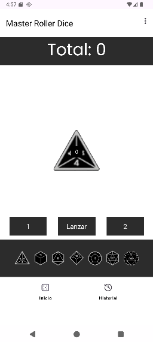
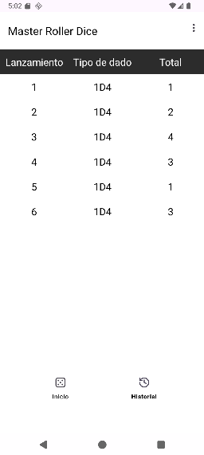
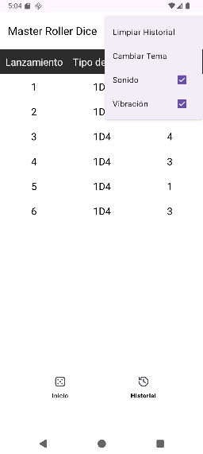

# Manual de usuario

## Inicio
Inicio componse de varias secciones.

La primera sección indica el total de los dados lanzados, la segunda el dado con su número y 3 botones para lanzar el dado o indicar el número de dados. Una fila donde elegir el tipo de dado donde se debe clickar sobre la imagen asociada al dado que se desea lanzar. Tambien existe una última para poder moverse al historial de tirada

## historial de tiradas

Esta vista muestra información sobre las tiradas realizadas, indicando el total, el número de tirada y la cantidad y tipo de dados usados en la tirada.

## Toolbar

La barra de herramientas permite al usuario iteractuar con varios opciones como el sonido, la vibración, el tema o limpiar el propio historial de tiradas.

